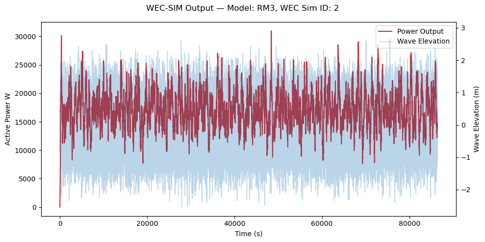
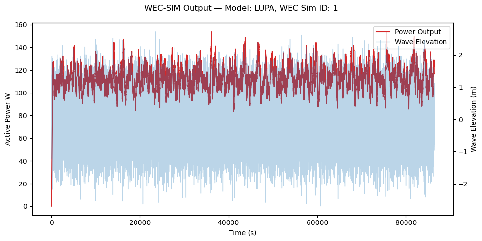

# WECGrid.db  - Pre-loaded Database

## Overview

A pre-loaded database is included with WEC-Grid to lower barriers to entry. It contains two WEC simulations (RM3 and LUPA) and corresponding grid simulations covering a 24-hour period. This allows users without MATLAB/WEC-Sim or PSS®E licenses to run examples immediately and compare results.

---

## Grid Simulations

### PSS®E: RTS-GMLC System

- **Flat Run** (ID = 1)  
    - Duration: 24 hours  
    - Resolution: 5 min (288 steps)  
    - Load curve: none  

- **WEC Run** (ID = 2)  
    - Duration: 24 hours  
    - Resolution: 5 min (288 steps)  
    - Configuration: RM3 Farm with 10 devices at Bus 326  
    - Load curve: none  

---

## WEC-Sim Runs

### RM3 

  

- **Simulation Details**
    - ID: 1
    - Model: RM3
    - Simulation length: 24 hours (86,400 s)  
    - Time step: 0.1 s  
    - Spectrum type: PM (Pierson–Moskowitz)  
    - Wave class: irregular  
    - Wave height: 2.5 m  
    - Wave period: 8.0 s  
    - Wave seed: 42  

---

### LUPA 

  

- **Simulation Details**
    - ID: 2
    - Model: LUPA (14 meter diameter)
    - Simulation length: 24 hours (86,400 s)  
    - Time step: 0.1 s  
    - Spectrum type: PM (Pierson–Moskowitz)  
    - Wave class: irregular  
    - Wave height: 2.5 m  
    - Wave period: 8.0 s  
    - Wave seed: 63  

---

### **Download** [WECGrid.db](https://github.com/acep-uaf/WEC-Grid/blob/main/examples/WECGrid.db)
