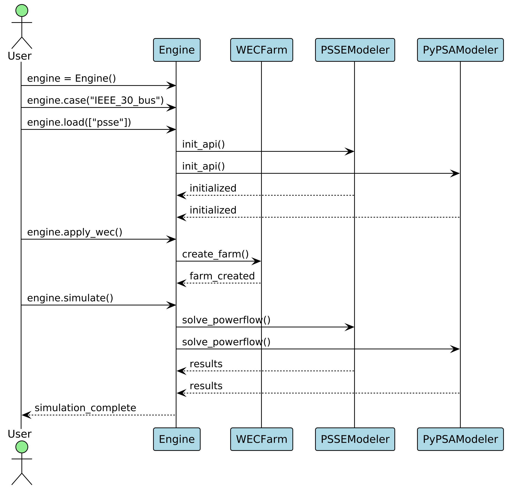
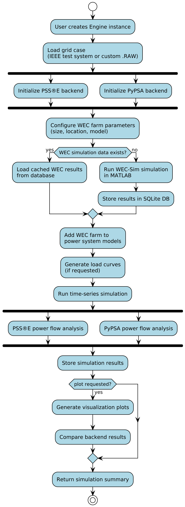

# Software Design

WEC-Grid is a bridge tool bringing together Wave Energy Converter Modeling and Grid Modeling.

Engine is the core component responsible for managing the interactions between the wave energy converters and the electrical grid. Manages the whole thing.

We have our modelers Power System Modelers (PyPSA & PSSE )and Wave Energy Converter Modeler (WEC-SIM)

  

  

