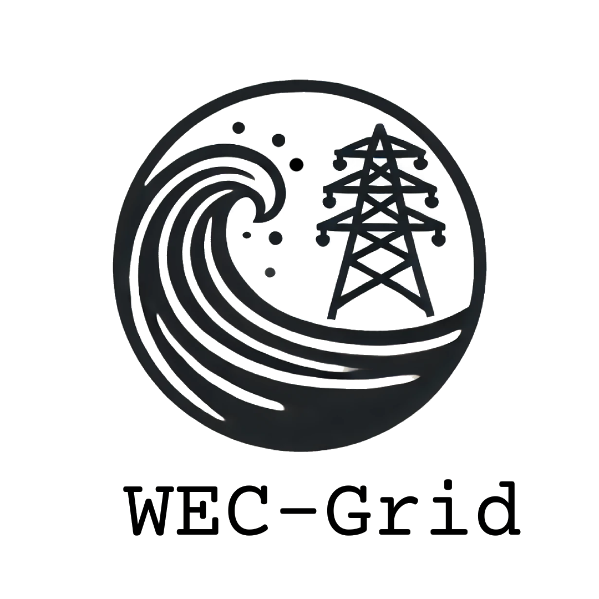

# WEC-Grid

  

**WEC-Grid** is an open-source software framework that integrates Wave Energy Converter (WEC) models into power system simulations, enabling preliminary integration studies of renewable wave energy with grid steady-state analysis.

## Overview

Wave energy integration into power grids faces a critical modeling gap: current power system tools (such as PSS®E, PyPSA) and marine hydrodynamic simulators (WEC-Sim) operate independently, hampering collaboration between marine energy and power system communities.

WEC-Grid bridges this gap by providing a unified modeling approach that accurately represents interactions between hydrodynamic behaviors and electrical power systems.

## Support
- **Documentation**: [acep-uaf.github.io/WEC-Grid](https://acep-uaf.github.io/WEC-Grid/)
- **Repository**: [github.com/acep-uaf/WEC-GRID](https://github.com/acep-uaf/WEC-GRID)
- **Contact**: barajale@oregonstate.edu

## Acknowledgments

This work is supported by the U.S. Department of Energy Office of Energy Efficiency and Renewable Energy, Water Power Technology Office (Grant #DE-EE0009445), University of Alaska Fairbanks, and Pacific Northwest National Laboratory.
